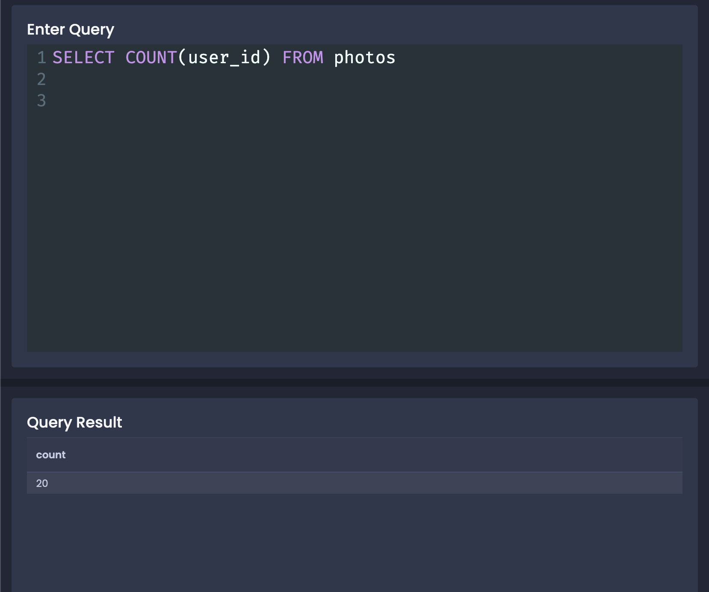
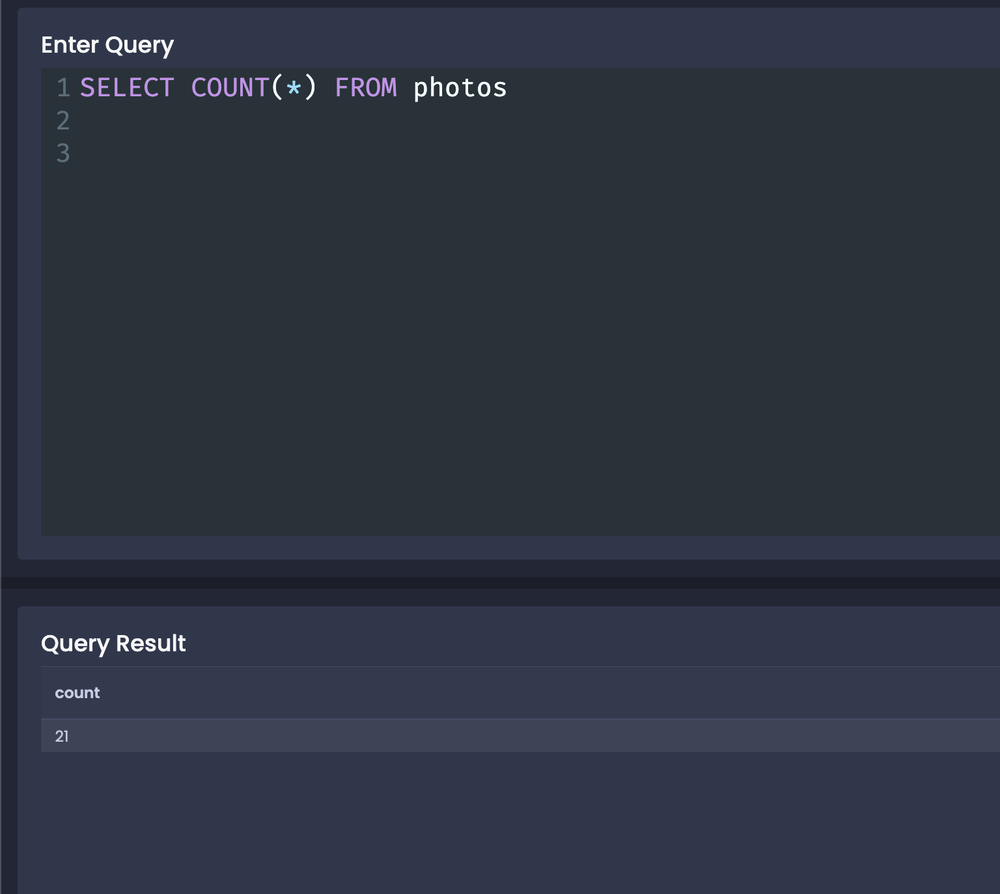

we had total 21 photos - inwhich one last photo does not have a user. it has null as userId

when we ran this
```
SELECT COUNT(user_id) FROM photos
```
we got 20 not 21.
so, null values are not counted



to count all rows:
```
SELECT COUNT(*) FROM photos

```
